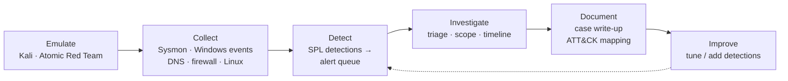
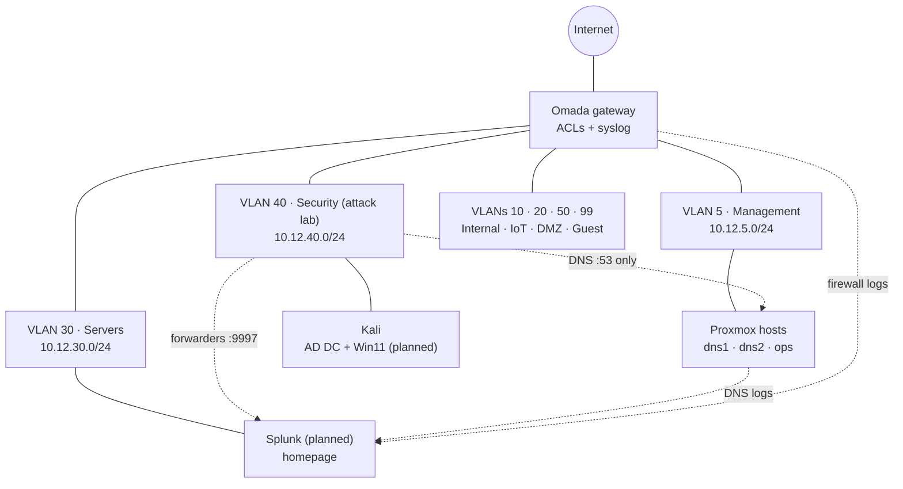

# Enterprise Homelab

A homelab built as a **small enterprise SOC environment**: segmented networks, an Active Directory target estate, Splunk as the SIEM, and an isolated attack VLAN. It exists to practice and demonstrate security operations: emulate an attack, detect it, investigate it, write it up.

> **Status:** infrastructure and documentation are in place. Lab isolation, Splunk, and the AD targets are being built now ([roadmap](docs/roadmap.md)). Investigations will appear below as they're completed.

## SOC workflow



| Evidence | Where |
|---|---|
| Investigations (case write-ups) | [`docs/investigations/`](docs/investigations/) |
| SPL detections, each tested against an emulated attack | [`detections/`](detections/) |
| Lab isolation rules, with before/after test results | [`docs/architecture/firewall-rules.md`](docs/architecture/firewall-rules.md) |
| Design decisions | [`docs/adr/`](docs/adr/) |

## Architecture



| | |
|---|---|
| **Hypervisor** | Proxmox VE: 3-node cluster (`TheRising`) + standalone storage node (`Sefi`), 32 threads / ~100 GiB RAM |
| **Network** | TP-Link Omada gateway. 7 VLANs (management, internal, IoT, servers, security lab, DMZ, guest) with a default-deny ACL policy |
| **SIEM** | Splunk Enterprise: Universal Forwarders, Sysmon, DNS and firewall logs, a homemade alert queue on Splunk Free ([ADR 0006](docs/adr/0006-soc-focus-with-splunk.md)) |
| **Targets** | Active Directory (Windows Server DC + Windows 11), rebuilt from golden templates |
| **Core services** | Redundant Technitium DNS (`demarzo.lab`) split across failure domains |

Detail: [overview](docs/architecture/overview.md) · [network](docs/architecture/network.md) · [firewall rules](docs/architecture/firewall-rules.md) · [compute](docs/architecture/compute.md) · [storage](docs/architecture/storage.md) · [DNS](docs/architecture/dns.md) · [live inventory](docs/inventory.md)

## Skills demonstrated

- **Security operations:** alert triage, investigation, incident documentation, MITRE ATT&CK mapping
- **Splunk:** data onboarding (forwarders, sourcetypes, indexes), SPL detections, dashboards, summary-index alerting
- **Endpoint telemetry:** Sysmon, Windows Security events, Active Directory logging
- **Network security:** VLAN segmentation, firewall ACL design, and verification testing
- **Infrastructure:** Proxmox clustering, templates, cloud-init, redundant DNS, docs as code

## Roadmap

| Phase | Focus | Status |
|---|---|---|
| 0 | Documentation foundation | ✅ Done |
| 1 | Hygiene: guest metadata, tags, admin host in the management zone | ✅ Mostly done |
| 2 | Safe to attack: isolate the lab VLAN | ⏳ Next |
| 3 | Visibility: Splunk plus log sources | 🗓️ Planned |
| 4 | Targets: Active Directory with Sysmon | 🗓️ Planned |
| 5 | SOC workflow evidence: emulate → detect → investigate → write up | 🗓️ Planned |

Full detail: [docs/roadmap.md](docs/roadmap.md)

## Repository layout

```
docs/
  investigations/  case write-ups (+ template)
  architecture/    how the lab is built, incl. firewall rules
  adr/             why it is built that way
  runbooks/        operational procedures
  inventory.md     generated from the Proxmox API
  roadmap.md
detections/        SPL detections
scripts/           inventory generator
```

## Security note

This repo is public. It contains private RFC 1918 addresses and the internal lab domain, which aren't reachable from outside. It contains no credentials, API tokens, keys, or public IPs. Commits are scanned with [gitleaks](https://github.com/gitleaks/gitleaks). All attack activity is confined to an isolated lab VLAN against systems I own.
