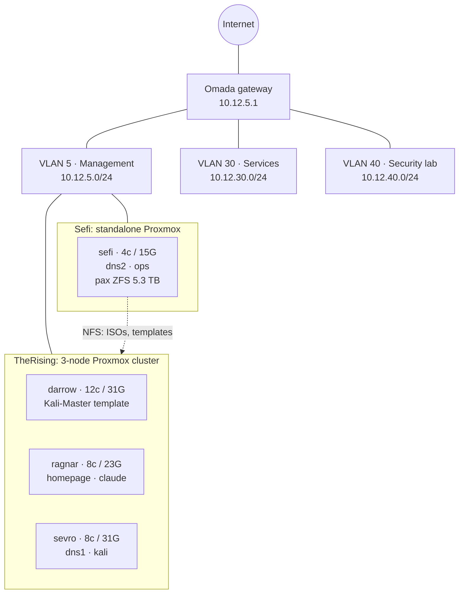

# Enterprise Homelab

A homelab built to run like a small enterprise environment, sized so one person can keep it running at home.

This repo is the documentation for the lab: architecture, the decisions behind it (ADRs), operational runbooks, and a roadmap. The docs are kept up to date with every change to the lab.

## At a glance

| | |
|---|---|
| **Hypervisor** | Proxmox VE: a 3-node cluster (`TheRising`) plus a standalone storage node (`Sefi`) |
| **Compute** | 32 CPU threads · ~100 GiB RAM across 4 nodes |
| **Storage** | Local ZFS for guest disks · 5.3 TB ZFS pool shared over NFS for ISOs and templates |
| **Network** | TP-Link Omada gateway · VLAN-segmented management, services, and security-lab networks |
| **Core services** | Redundant internal DNS (Technitium, `demarzo.lab`), one server per Proxmox environment |
| **Security lab** | Isolated Kali Linux VLAN with a golden template and snapshot-based resets |

## Architecture



More detail: [architecture overview](docs/architecture/overview.md) · [network](docs/architecture/network.md) · [compute](docs/architecture/compute.md) · [storage](docs/architecture/storage.md) · [DNS](docs/architecture/dns.md) · [live inventory](docs/inventory.md)

## What this lab shows

- **Virtualization and clustering:** a quorum-based Proxmox cluster, templates, cloud-init provisioning, snapshots
- **Network segmentation:** VLAN-aware bridges with separate management, service, and attack-lab networks
- **Resilient core services:** a DNS pair split across independent failure domains
- **Docs as code:** architecture decision records, runbooks, and an inventory generated from the Proxmox API ([`scripts/inventory.py`](scripts/inventory.py))
- **Security practice:** an isolated offensive-security VLAN, with defensive tooling (SIEM) on the [roadmap](docs/roadmap.md)

## Roadmap

The lab is being built out in phases. Each item is marked done only when it has evidence (a restore test, a working alert, etc.). Full detail: [docs/roadmap.md](docs/roadmap.md).

| Phase | Focus | Status |
|---|---|---|
| 0 | Documentation foundation: this repo | ✅ Done |
| 1 | Hygiene: DNS records, guest metadata, VLAN firewall rules | ⏳ Next |
| 2 | Enterprise core: backups (PBS), config management (Ansible), monitoring, SIEM (Wazuh) | 🗓️ Planned |
| 3 | Stretch: Active Directory, Terraform, offsite backups | 💭 Optional |

## Repository layout

```
docs/
  architecture/   how the lab is built
  adr/            why it is built that way (architecture decision records)
  runbooks/       step-by-step operational procedures
  inventory.md    generated: nodes, guests, storage
  roadmap.md      phased build-out plan
scripts/
  inventory.py    regenerates docs/inventory.md from the Proxmox API
```

## Security note

This repo is public. It contains private RFC 1918 addresses and the internal lab domain, which aren't reachable from outside. It contains no credentials, API tokens, keys, or public IPs. The inventory script reads its API token from a config file outside the repo, and commits are scanned with [gitleaks](https://github.com/gitleaks/gitleaks).
