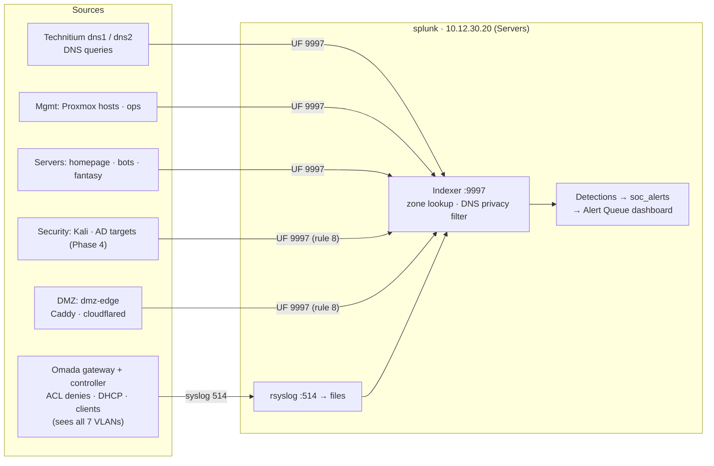

# SIEM (Splunk)

**Status:** Splunk 10.4.4 running since 2026-09-30 (trial). Onboarding of data sources in progress ([roadmap Phase 3](../roadmap.md)). Decisions: [ADR 0006](../adr/0006-soc-focus-with-splunk.md) (why Splunk) and [ADR 0007](../adr/0007-splunk-topology-and-household-data.md) (topology and household data).

## Design
One Splunk Enterprise instance in the **Servers** zone (`splunk`, VMID 210, 10.12.30.20, on darrow; 4 vCPU / 8 GiB / 150 GiB) sees all seven VLANs through three layers:

1. **Chokepoint logs** that already observe every zone: the **Omada** gateway/controller (ACL denies, DHCP leases, client events) and **Technitium DNS** (queries from every zone that uses it).
2. **Universal Forwarders** only on hosts the lab owns: infrastructure, the Security lab, and the DMZ.
3. **Zone enrichment:** a CIDR lookup ([`vlan_zones.csv`](../../splunk/apps/homelab_base/lookups/vlan_zones.csv)) tags every IP with its zone and trust level, so searches, dashboards, and detections can reason about trust boundaries (e.g. "Security → Management").

## Coverage by VLAN
| VLAN | Zone | What Splunk sees | Agents |
|---|---|---|---|
| 5 | Management | Proxmox journald, Technitium, ops, Omada controller | UF on PVE hosts, dns1/2, ops |
| 10 | Internal | Firewall denies, DHCP, DNS **security signals only** | None (household devices) |
| 20 | IoT | Firewall denies, DHCP, **full DNS** | None (can't install agents) |
| 30 | Servers | Splunk `_internal`, homepage, bots, fantasy | UF on homepage, bots, fantasy |
| 40 | Security | Kali, then AD DC + Windows 11 with Sysmon (Phase 4) | UF (+ Sysmon) |
| 50 | DMZ | `dmz-edge` Caddy access logs, cloudflared, OS logs | UF on dmz-edge |
| 99 | Guest | Firewall denies, DHCP | None |

Internal, IoT, and Guest are deliberately covered **at network level only**: the enterprise pattern for unmanaged devices, and no software on household devices.

## Indexes
By data type, not by VLAN. The zone comes from the lookup. Definitions: [`indexes.conf`](../../splunk/apps/homelab_base/default/indexes.conf).

| Index | Data | Retention |
|---|---|---|
| `netfw` | Omada: ACL, DHCP, client events | 90 d |
| `dns` | Technitium query logs | 30 d |
| `linux` | auth, syslog, journald (Linux guests, Proxmox hosts) | 90 d |
| `web` | dmz-edge Caddy access logs, cloudflared | 90 d |
| `wineventlog`, `sysmon` | Phase 4 Windows targets | 90 d |
| `soc_alerts` | Detection hits (summary index behind the Alert Queue) | 365 d |

## Onboarded sources
| Source | Sender | Sourcetype | Index | Status |
|---|---|---|---|---|
| ER605 gateway: ACL events | 10.12.30.1 (sends from its Servers interface) | `omada:gateway` | `netfw` | ✅ 2026-09-30. Fields: `src_ip`, `dest_ip`, `dest_port`, `action`, `acl_id`, zones |
| Omada controller: DHCP, client events | 10.12.5.2 | `omada:controller` | `netfw` | ✅ 2026-09-30. DHCP → `src_ip`, `src_mac` |
| Access point: Wi-Fi client flows | 10.12.5.200 | `omada:eap` | `netfw` | ✅ 2026-09-30. **Household flows dropped at index time** |
| Unknown future senders | any | `syslog:unclassified` | `netfw` | Catch-all, so nothing is silently misparsed |
| Technitium DNS query logs | dns1, dns2 (UF, `/var/log/technitium/dns/`) | `technitium:query` | `dns` | ✅ 2026-09-30. Fields: `src_ip`, `query`, `query_type`, `reply_code`, `answer`, `query_length`, `src_zone`. ~61k queries/day (~10–12 MB) |
| System journal | ops, dns1, dns2 (UF) | `journald` | `linux` | ✅ 2026-09-30 |

**Timestamps:** the Omada devices' clocks were ~3 minutes slow, and the access point's syslog header also had a wrong UTC offset (fixed at the source on 2026-09-30 with NTP and a DST-aware time zone). rsyslog prefixes every line with its own **NTP-synced receive time**, and Splunk uses that as `_time`. The device's timestamp stays in the raw event. Verified: a probe from kali at 11:30:58 was indexed at 11:30:58.

**ACL rule IDs:** the gateway logs a numeric rule ID (`DESC=`), not the rule name. Observed so far: `1714321509` = DENY Inter-LAN (rule 12). A lookup mapping IDs to names will be added as more IDs show up.

## Privacy rules
- **Household DNS:** queries from Internal (10.12.10.0/24) and Guest (10.12.99.0/24) are dropped at index time **unless** they failed or were blocked (NXDOMAIN, SERVFAIL, REFUSED, or a `0.0.0.0`/`::` answer). Failures that are only search-domain artifacts (`<site>.demarzo.lab` NXDOMAIN) are dropped too, because they'd reveal the site being browsed. Security signals stay, and browsing history is never stored ([ADR 0007](../adr/0007-splunk-topology-and-household-data.md)). Verified with a 7-case test file (all correct) and on live data (Internal shows only failures).
- **Household Wi-Fi flows:** the access point logs every client connection. Records to or from Internal or Guest are sent to `nullQueue` ([`transforms.conf`](../../splunk/apps/homelab_base/default/transforms.conf) `drop_household_eap`). Verified: 0 household records indexed, while ~1,000 were present in the raw stream.
- **Raw syslog buffer:** `/var/log/remote` holds the unfiltered stream until Splunk reads it (seconds). Only **today's** file is kept ([cron job](../../splunk/server/cron-remote-cleanup)).
- **Website visitors:** dmz-edge logs contain real visitors' IP addresses. Raw events and screenshots of them are **never** published in this repo, only aggregates.

## Access control
Splunk Free has no authentication, so network controls are the only protection. They're layered:

| Port | Allowed from | Enforced by |
|---|---|---|
| 8000 (web UI) | Management, Admin Terminals | Host firewall (ufw) on `splunk`. The gateway ACL alone would allow all of Internal (rule 3) |
| 9997 (forwarders) | Management, Servers, Security, DMZ | Gateway ACL rules 2 and 8, plus ufw |
| 514 (syslog) | Gateway, Omada controller, Proxmox hosts | ufw |
| 22 (SSH) | Management. A leftover rule still allows 10.12.30.101 (`bots`, formerly the `claude` workstation) and is due to be removed | ufw |

## License budget
Splunk Free allows 500 MB/day. Estimates, to be replaced with measured values after a week of data:

| Source | Est. MB/day |
|---|---|
| Omada | 10–50 |
| Technitium (filtered) | 20–80 |
| Linux + Proxmox | 20–50 |
| dmz-edge | 5–50 |
| Windows + Sysmon (Phase 4) | 100–250 |
| **Total** | **~155–480** |
